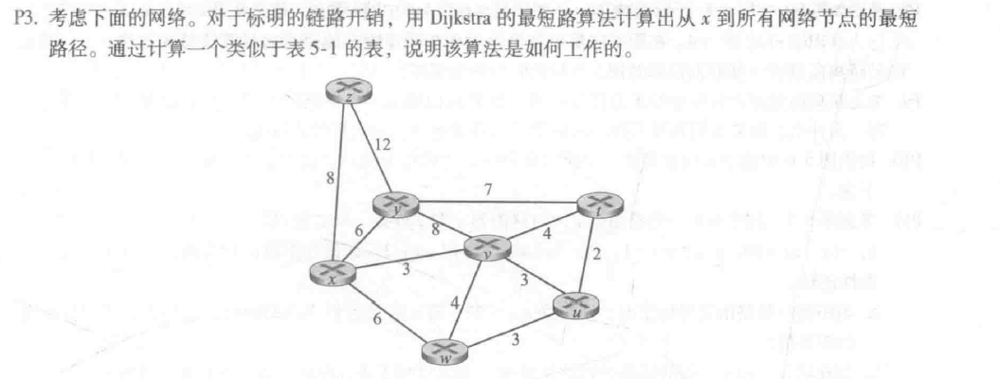
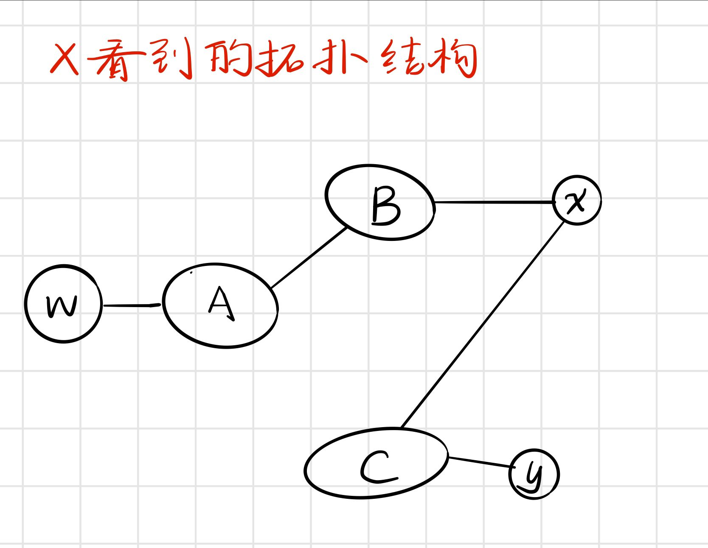

# 身份信息

姓名：陈俊杰

学号：2017302580109

# 第8次作业

选取第5章——网络层：控制平面的习题

+ P3

| 步骤数 | $ N^{'} $ | D(t), p(t) | D(u),p(u) | D(v),p(v) | D(w),p(w) | D(y),p(y) | D(z),p(z) |
| ------ | --------- | ---------- | --------- | --------- | --------- | --------- | --------- |
| 1      | x         | ∞          | ∞         | 3, x      | 6, x      | 6, x      | 8, x      |
| 2      | xv        | 7, v       | 6, v      | 3, x      | 6, x      | 6, x      | 8, x      |
| 3      | xvu       | 7, v       | 6, v      | 3, x      | 6, x      | 6, x      | 8, x      |
| 4      | xvuw      | 7, v       | 6, v      | 3, x      | 6, x      | 6, x      | 8, x      |
| 5      | xvuwy     | 7, v       | 6, v      | 3, x      | 6, x      | 6, x      | 8, x      |
| 6      | xvuwyt    | 7, v       | 6, v      | 3, x      | 6, x      | 6, x      | 8, x      |
| 7      | xvuwytz   | 7, v       | 6, v      | 3, x      | 6, x      | 6, x      | 8, x      |

+ P9

不会出现无穷计数问题，如果链路本身没有循环，减少链路开销不会导致循环，因为这是由两个节点之间的下一跳关系引起的。

如果将没有链路的两个节点连接起来，会将链路权重从无限变为有限权。

+ P17

  

  + 基于**W**处的信息，看到的网络拓扑结构：

    

  + 基于**X**处的信息，看到的网络拓扑结构：

    

  产生这种结果的原因是：通往目标的路径上，X没有收到同时包含AS A和AS C的通告，也就是说X对AC链路一无所知。
